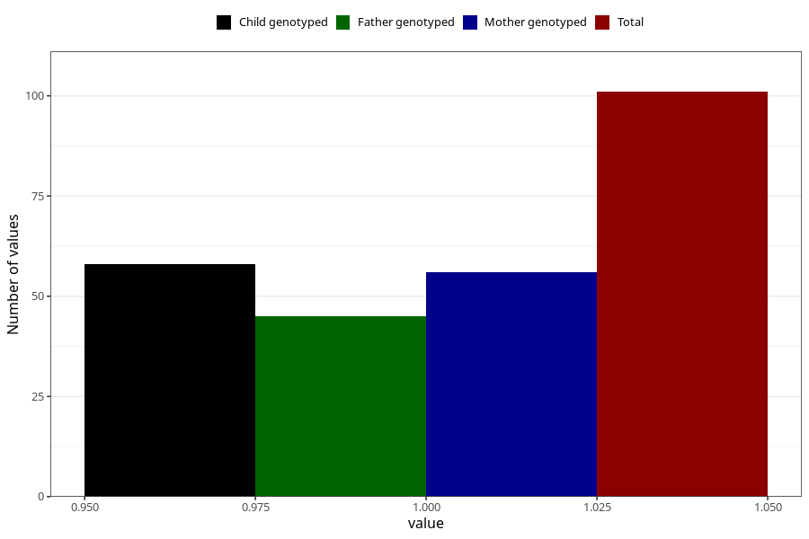

# cerebral_palsy_7y
Variable mapping to questionnaire: q8, question JJ430.
- Number of values:

| Value | Total | Child genotyped | Mother genotyped | Father genotyped |
| ----- | ----- | --------------- | ---------------- | ---------------- |
| Missing | 113522 | 75373 | 71713 | 50173 |
| Non-missing | 101 | 58 | 56 | 45 |
| 1 | 101 | 58 | 56 | 45 |

