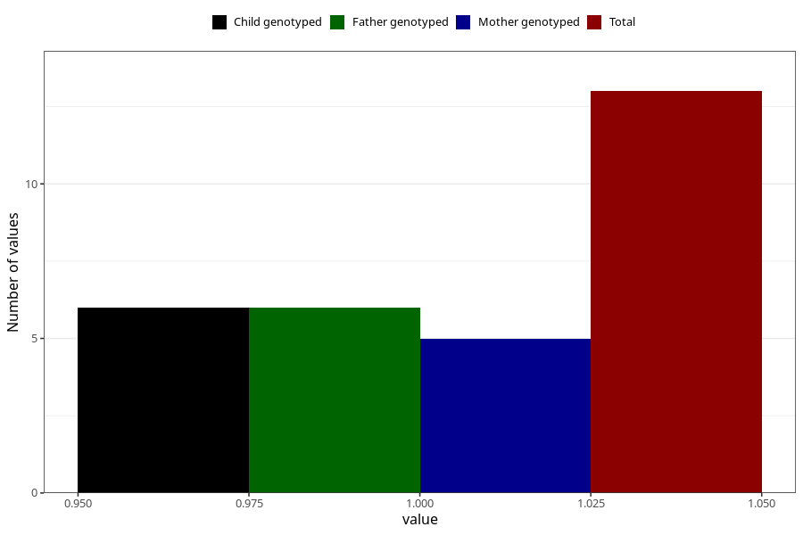

# cerebral_palsy_previous_3y
Variable mapping to questionnaire: q6, question GG43.
- Number of values:

| Value | Total | Child genotyped | Mother genotyped | Father genotyped |
| ----- | ----- | --------------- | ---------------- | ---------------- |
| Missing | 113610 | 75425 | 71764 | 50212 |
| Non-missing | 13 | 6 | 5 | 6 |
| 1 | 13 | 6 | 5 | 6 |

