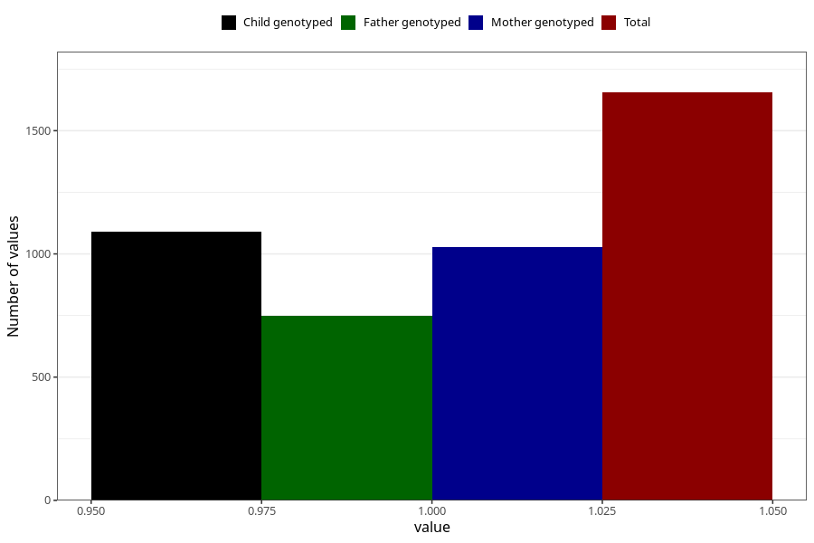

# delayed_motor_development_previously_18m
Variable mapping to questionnaire: q5, question EE801.
- Number of values:

| Value | Total | Child genotyped | Mother genotyped | Father genotyped |
| ----- | ----- | --------------- | ---------------- | ---------------- |
| Missing | 111968 | 74339 | 70742 | 49468 |
| Non-missing | 1655 | 1092 | 1027 | 750 |
| 1 | 1655 | 1092 | 1027 | 750 |

