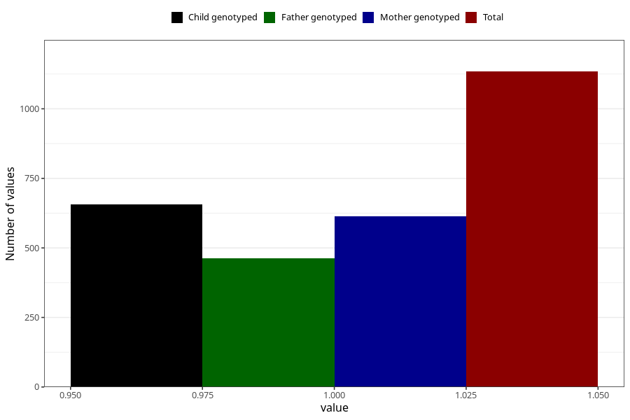

# delayed_motor_development_yes_18m
Variable mapping to questionnaire: q5, question EE800.
- Number of values:

| Value | Total | Child genotyped | Mother genotyped | Father genotyped |
| ----- | ----- | --------------- | ---------------- | ---------------- |
| Missing | 112489 | 74774 | 71155 | 49756 |
| Non-missing | 1134 | 657 | 614 | 462 |
| 1 | 1134 | 657 | 614 | 462 |

