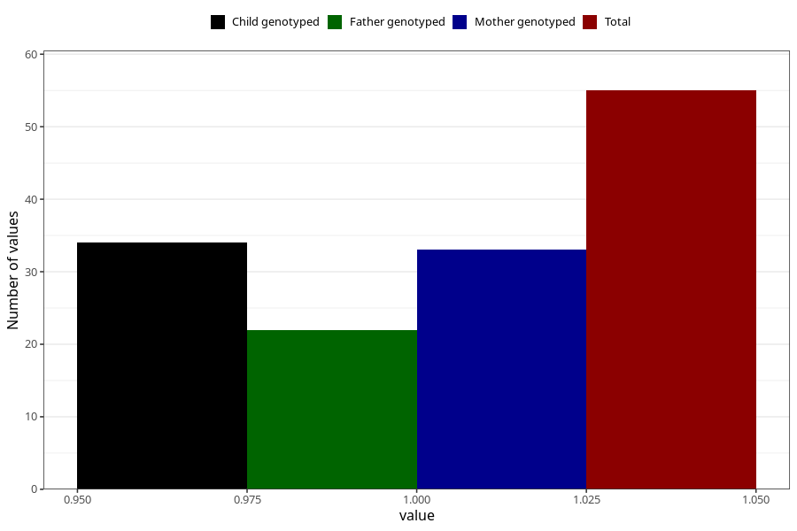

# delayed_speech_development_previously_18m
Variable mapping to questionnaire: q5, question EE841.
- Number of values:

| Value | Total | Child genotyped | Mother genotyped | Father genotyped |
| ----- | ----- | --------------- | ---------------- | ---------------- |
| Missing | 113568 | 75397 | 71736 | 50196 |
| Non-missing | 55 | 34 | 33 | 22 |
| 1 | 55 | 34 | 33 | 22 |

