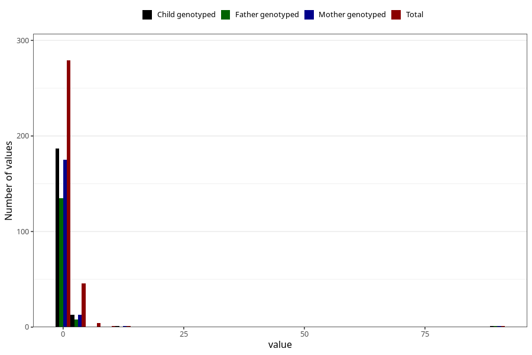

# febrile_convulsions_freq_6m
Variable mapping to questionnaire: q4, question DD296.
- Number of values:

| Value | Total | Child genotyped | Mother genotyped | Father genotyped |
| ----- | ----- | --------------- | ---------------- | ---------------- |
| Missing | 113291 | 75229 | 71579 | 50074 |
| Non-missing | 332 | 202 | 190 | 144 |
| 0 | 127 | 86 | 81 | 65 |
| 1 | 152 | 101 | 94 | 70 |
| 2 | 34 | 11 | 11 | 7 |
| 3 | 8 | 1 | 1 | 1 |
| 4 | 4 | 1 | 1 | 0 |
| 5 | 3 | 0 | 0 | 0 |
| 7 | 1 | 0 | 0 | 0 |
| 8 | 1 | 0 | 0 | 0 |
| 11 | 1 | 1 | 1 | 0 |
| 90 | 1 | 1 | 1 | 1 |

