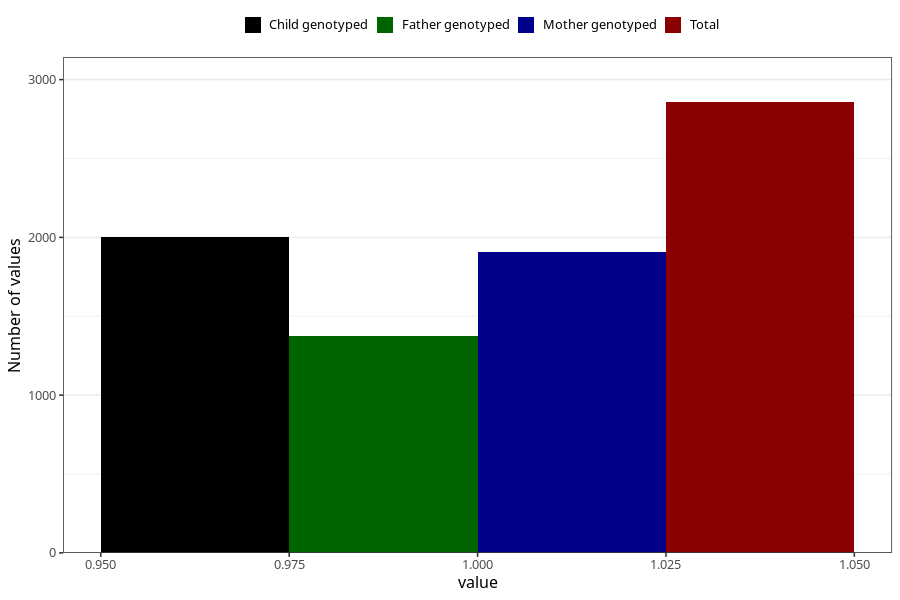

# food_allergy_yes_3y
Variable mapping to questionnaire: q6, question GG86.
- Number of values:

| Value | Total | Child genotyped | Mother genotyped | Father genotyped |
| ----- | ----- | --------------- | ---------------- | ---------------- |
| Missing | 110766 | 73428 | 69862 | 48842 |
| Non-missing | 2857 | 2003 | 1907 | 1376 |
| 1 | 2857 | 2003 | 1907 | 1376 |

