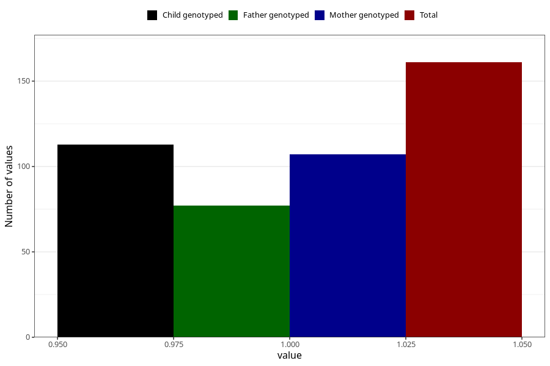

# hip_disorder_dislocated_hip_yes_18m
Variable mapping to questionnaire: q5, question EE788.
- Number of values:

| Value | Total | Child genotyped | Mother genotyped | Father genotyped |
| ----- | ----- | --------------- | ---------------- | ---------------- |
| Missing | 113462 | 75318 | 71662 | 50141 |
| Non-missing | 161 | 113 | 107 | 77 |
| 1 | 161 | 113 | 107 | 77 |

