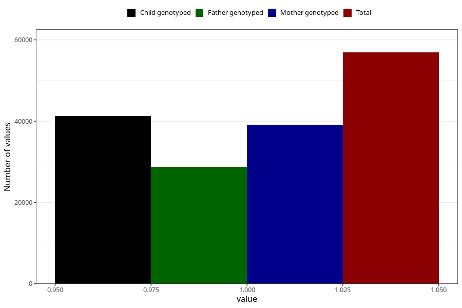

# impaired_vision_no_3y
Variable mapping to questionnaire: q6, question GG33.
- Number of values:

| Value | Total | Child genotyped | Mother genotyped | Father genotyped |
| ----- | ----- | --------------- | ---------------- | ---------------- |
| Missing | 56727 | 34192 | 32594 | 21480 |
| Non-missing | 56896 | 41239 | 39175 | 28738 |
| 1 | 56896 | 41239 | 39175 | 28738 |

