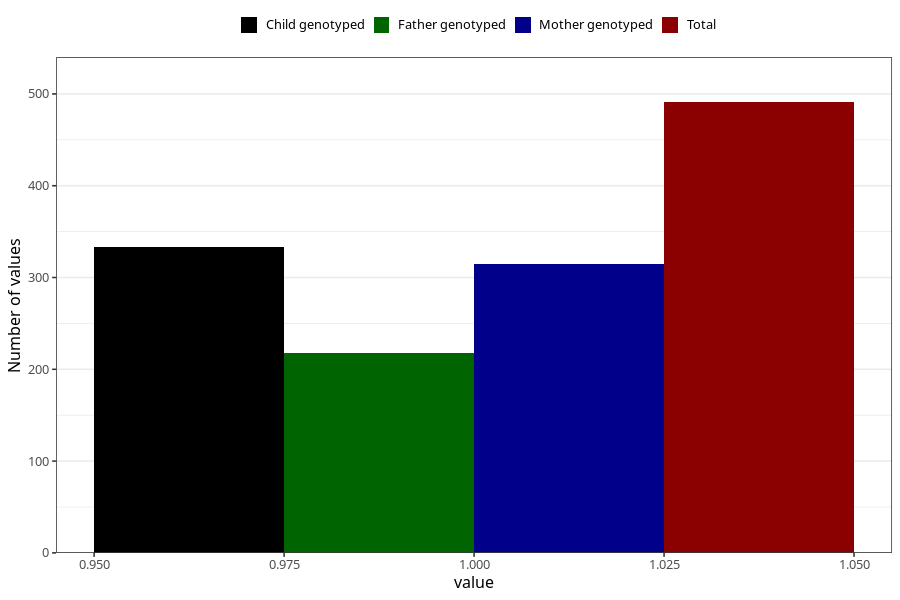

# impaired_vision_yes_18m
Variable mapping to questionnaire: q5, question EE796.
- Number of values:

| Value | Total | Child genotyped | Mother genotyped | Father genotyped |
| ----- | ----- | --------------- | ---------------- | ---------------- |
| Missing | 113132 | 75098 | 71454 | 50000 |
| Non-missing | 491 | 333 | 315 | 218 |
| 1 | 491 | 333 | 315 | 218 |

