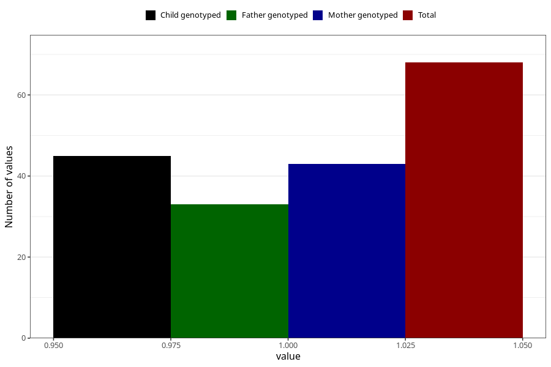

# other_behavioral_problems_previous_3y
Variable mapping to questionnaire: q6, question GG111.
- Number of values:

| Value | Total | Child genotyped | Mother genotyped | Father genotyped |
| ----- | ----- | --------------- | ---------------- | ---------------- |
| Missing | 113555 | 75386 | 71726 | 50185 |
| Non-missing | 68 | 45 | 43 | 33 |
| 1 | 68 | 45 | 43 | 33 |

