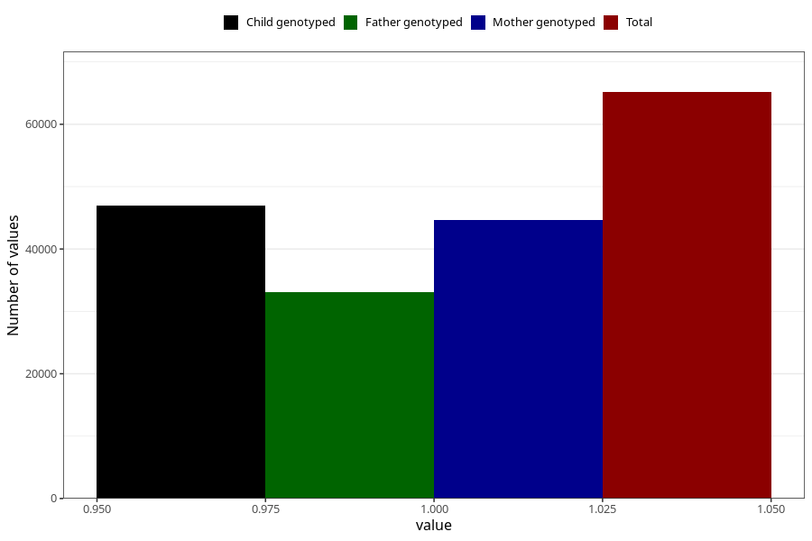

# sleep_problems_no_18m
Variable mapping to questionnaire: q5, question EE843.
- Number of values:

| Value | Total | Child genotyped | Mother genotyped | Father genotyped |
| ----- | ----- | --------------- | ---------------- | ---------------- |
| Missing | 48474 | 28412 | 27082 | 17175 |
| Non-missing | 65149 | 47019 | 44687 | 33043 |
| 1 | 65149 | 47019 | 44687 | 33043 |

