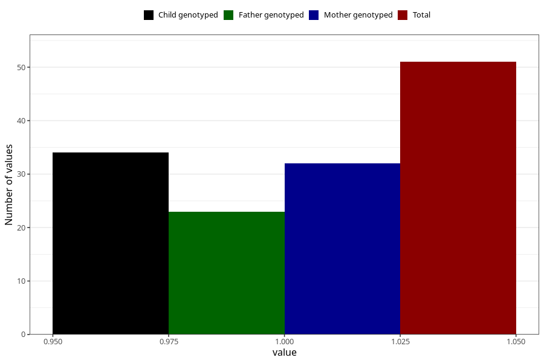

# social_problems_previously_18m
Variable mapping to questionnaire: q5, question EE969.
- Number of values:

| Value | Total | Child genotyped | Mother genotyped | Father genotyped |
| ----- | ----- | --------------- | ---------------- | ---------------- |
| Missing | 113572 | 75397 | 71737 | 50195 |
| Non-missing | 51 | 34 | 32 | 23 |
| 1 | 51 | 34 | 32 | 23 |

