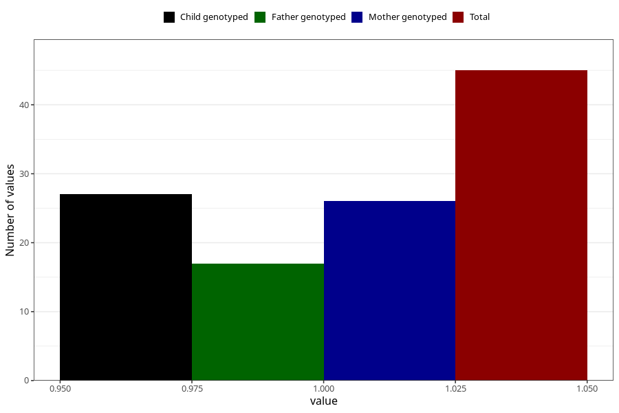

# social_problems_yes_18m
Variable mapping to questionnaire: q5, question EE968.
- Number of values:

| Value | Total | Child genotyped | Mother genotyped | Father genotyped |
| ----- | ----- | --------------- | ---------------- | ---------------- |
| Missing | 113578 | 75404 | 71743 | 50201 |
| Non-missing | 45 | 27 | 26 | 17 |
| 1 | 45 | 27 | 26 | 17 |

