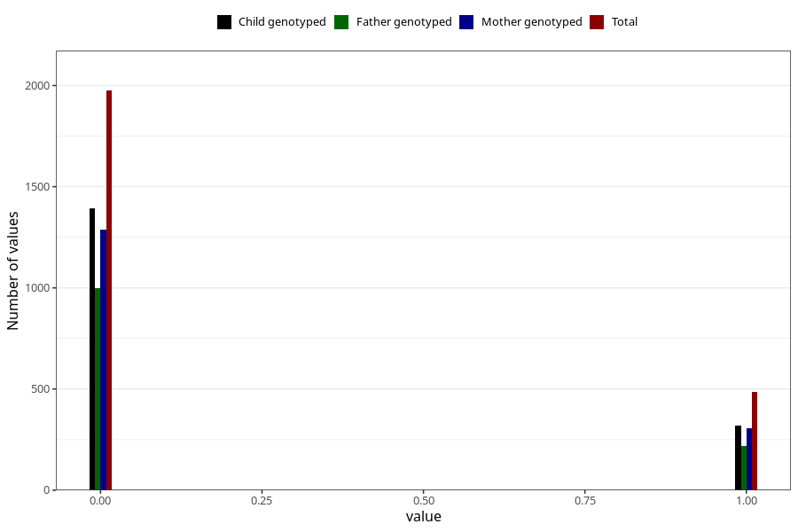

# specialist_diagnosis_3_3y
Variable mapping to questionnaire: q6, question GG122.
- Number of values:

| Value | Total | Child genotyped | Mother genotyped | Father genotyped |
| ----- | ----- | --------------- | ---------------- | ---------------- |
| Missing | 111160 | 73719 | 70175 | 49002 |
| Non-missing | 2463 | 1712 | 1594 | 1216 |
| 0 | 1975 | 1393 | 1290 | 998 |
| 1 | 488 | 319 | 304 | 218 |

