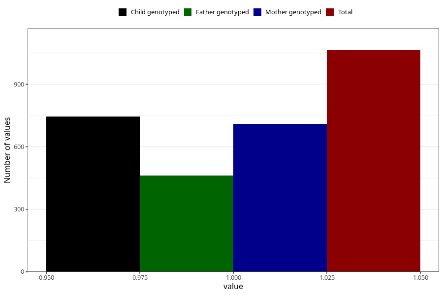

# formula_colett_4m
Variable mapping to questionnaire: q4, question DD60.
- Number of values:

| Value | Total | Child genotyped | Mother genotyped | Father genotyped |
| ----- | ----- | --------------- | ---------------- | ---------------- |
| Missing | 112560 | 74685 | 71060 | 49757 |
| Non-missing | 1063 | 746 | 709 | 461 |
| 1 | 1063 | 746 | 709 | 461 |

