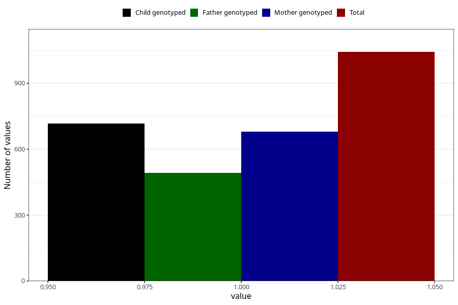

# formula_colett_6m
Variable mapping to questionnaire: q4, question DD62.
- Number of values:

| Value | Total | Child genotyped | Mother genotyped | Father genotyped |
| ----- | ----- | --------------- | ---------------- | ---------------- |
| Missing | 112580 | 74714 | 71088 | 49726 |
| Non-missing | 1043 | 717 | 681 | 492 |
| 1 | 1043 | 717 | 681 | 492 |

