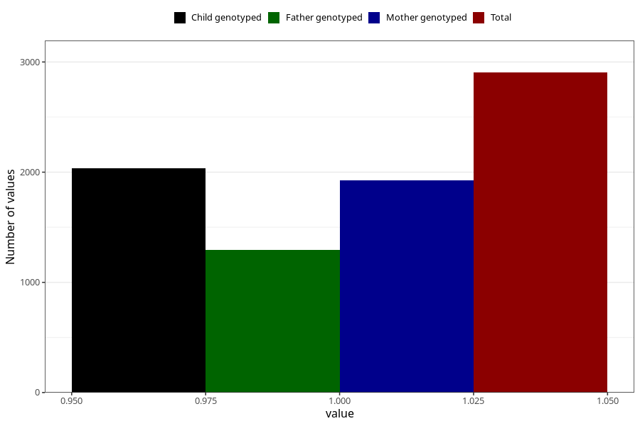

# formula_colett_omega3_2m
Variable mapping to questionnaire: q4, question DD65.
- Number of values:

| Value | Total | Child genotyped | Mother genotyped | Father genotyped |
| ----- | ----- | --------------- | ---------------- | ---------------- |
| Missing | 110719 | 73397 | 69841 | 48922 |
| Non-missing | 2904 | 2034 | 1928 | 1296 |
| 1 | 2904 | 2034 | 1928 | 1296 |

