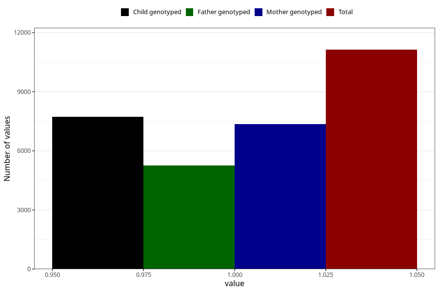

# formula_nan_2m
Variable mapping to questionnaire: q4, question DD72.
- Number of values:

| Value | Total | Child genotyped | Mother genotyped | Father genotyped |
| ----- | ----- | --------------- | ---------------- | ---------------- |
| Missing | 102493 | 67704 | 64415 | 44950 |
| Non-missing | 11130 | 7727 | 7354 | 5268 |
| 1 | 11130 | 7727 | 7354 | 5268 |

