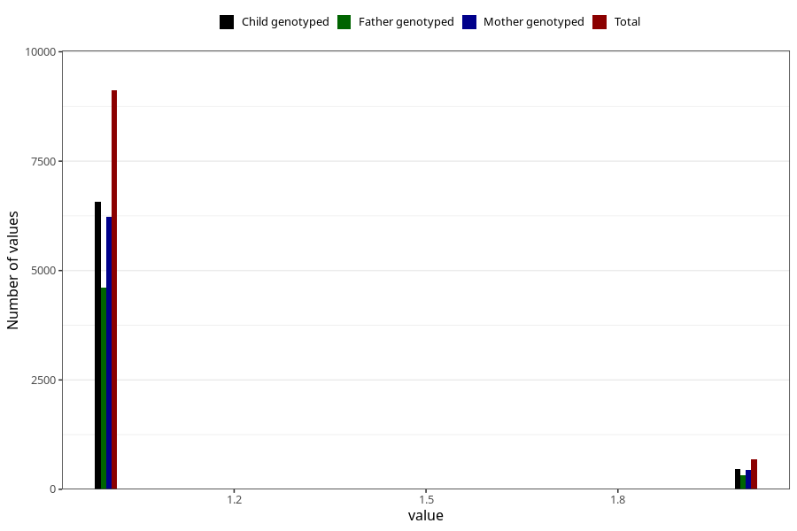

# multivitamins_capsules_amount_per_time_7y
Variable mapping to questionnaire: q8, question JJ538.
- Number of values:

| Value | Total | Child genotyped | Mother genotyped | Father genotyped |
| ----- | ----- | --------------- | ---------------- | ---------------- |
| Missing | 103797 | 68379 | 65087 | 45260 |
| Non-missing | 9826 | 7052 | 6682 | 4958 |
| 3+ at a time | 24 | 14 | 14 |9 |
| More than 1 check box filled in | 5 | 3 | 3 |2 |
| 1 | 9116 | 6577 | 6227 | 4616 |
| 2 | 681 | 458 | 438 | 331 |

