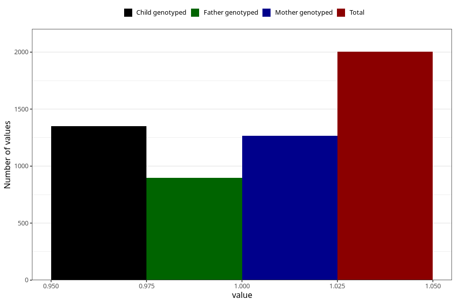

# other_milk_3m
Variable mapping to questionnaire: q4, question DD87.
- Number of values:

| Value | Total | Child genotyped | Mother genotyped | Father genotyped |
| ----- | ----- | --------------- | ---------------- | ---------------- |
| Missing | 111620 | 74080 | 70502 | 49319 |
| Non-missing | 2003 | 1351 | 1267 | 899 |
| 1 | 2003 | 1351 | 1267 | 899 |

