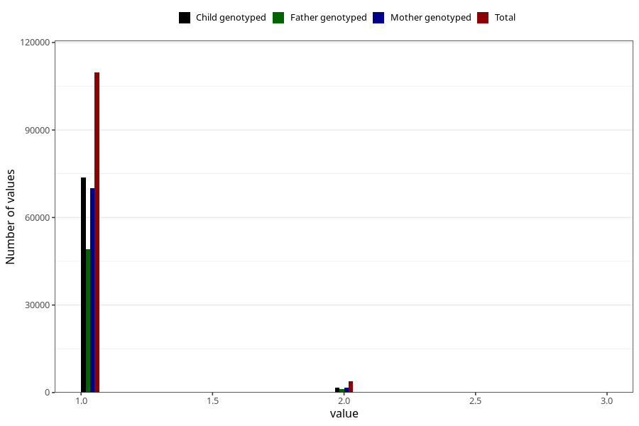

# plurality
Variable mapping to questionnaire: mfr, question PLURAL.
- Number of values:

| Value | Total | Child genotyped | Mother genotyped | Father genotyped |
| ----- | ----- | --------------- | ---------------- | ---------------- |
| Missing | 0 | 0 | 0 | 0 |
| Non-missing | 113623 | 75431 | 71769 | 50218 |
| 1 | 109689 | 73674 | 70076 | 49097 |
| 2 | 3871 | 1740 | 1676 | 1114 |
| 3 | 63 | 17 | 17 | 7 |

