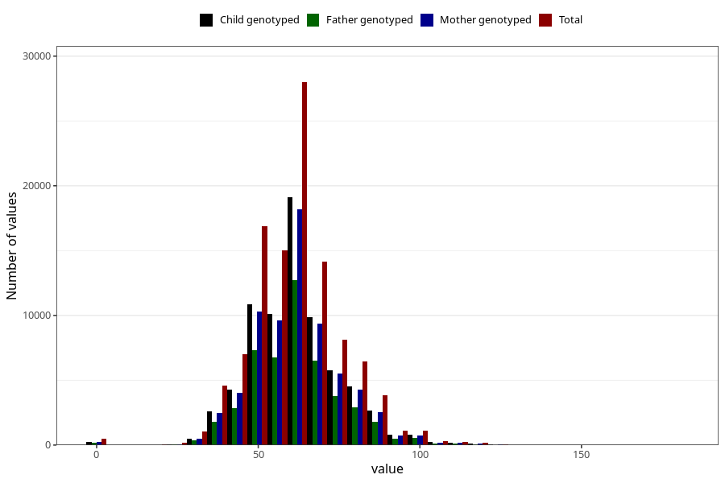

# umbilical_cord_length
Variable mapping to questionnaire: mfr, question NAVLESNORLENGDE.
- Number of values:

| Value | Total | Child genotyped | Mother genotyped | Father genotyped |
| ----- | ----- | --------------- | ---------------- | ---------------- |
| Missing | 4754 | 2697 | 2539 | 1825 |
| Non-missing | 108869 | 72734 | 69230 | 48393 |
| 25th percentile | 51 | 52 | 52 | 52 |
| 50th percentile | 60 | 60 | 60 | 60 |
| 75th percentile | 70 | 70 | 70 | 70 |

