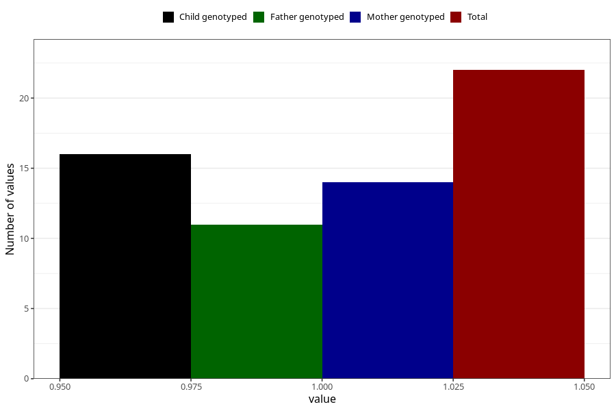

# cocaine_during
Variable mapping to questionnaire: q1m, question AA1447.
- Number of values:

| Value | Total | Child genotyped | Mother genotyped | Father genotyped |
| ----- | ----- | --------------- | ---------------- | ---------------- |
| Missing | 113601 | 75415 | 71755 | 50207 |
| Non-missing | 22 | 16 | 14 | 11 |
| 1 | 22 | 16 | 14 | 11 |

