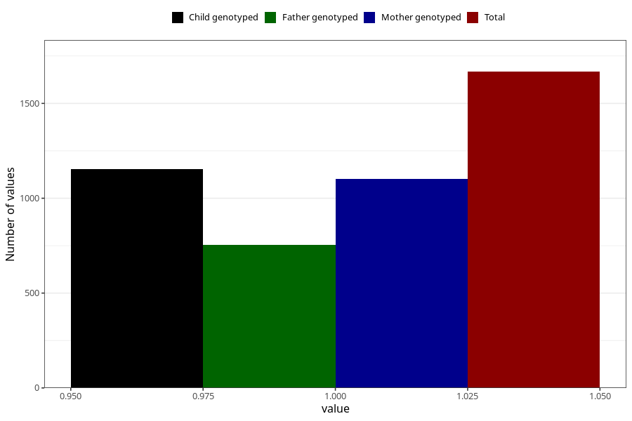

# endometriosis_before
Variable mapping to questionnaire: q1m, question AA689.
- Number of values:

| Value | Total | Child genotyped | Mother genotyped | Father genotyped |
| ----- | ----- | --------------- | ---------------- | ---------------- |
| Missing | 111956 | 74277 | 70667 | 49464 |
| Non-missing | 1667 | 1154 | 1102 | 754 |
| 1 | 1667 | 1154 | 1102 | 754 |

