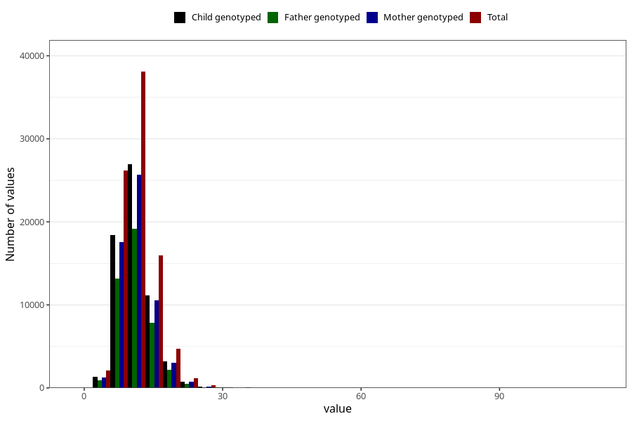

# iron
Variable mapping to questionnaire: q2_cwd_calculations, question JERN.
- Number of values:

| Value | Total | Child genotyped | Mother genotyped | Father genotyped |
| ----- | ----- | --------------- | ---------------- | ---------------- |
| Missing | 24927 | 13198 | 12674 | 6238 |
| Non-missing | 88696 | 62233 | 59095 | 43980 |
| 25th percentile | 8.92 | 8.93 | 8.93 | 8.93 |
| 50th percentile | 10.88 | 10.86 | 10.86 | 10.85 |
| 75th percentile | 13.28 | 13.24 | 13.23 | 13.2 |

