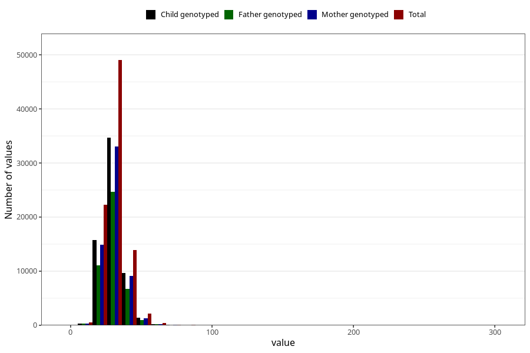

# niacin_eq
Variable mapping to questionnaire: q2_cwd_calculations, question NIACIN_EQ.
- Number of values:

| Value | Total | Child genotyped | Mother genotyped | Father genotyped |
| ----- | ----- | --------------- | ---------------- | ---------------- |
| Missing | 24927 | 13198 | 12674 | 6238 |
| Non-missing | 88696 | 62233 | 59095 | 43980 |
| 25th percentile | 25.79 | 25.78 | 25.78 | 25.77 |
| 50th percentile | 29.9 | 29.85 | 29.84 | 29.78 |
| 75th percentile | 34.65 | 34.53 | 34.51 | 34.44 |

