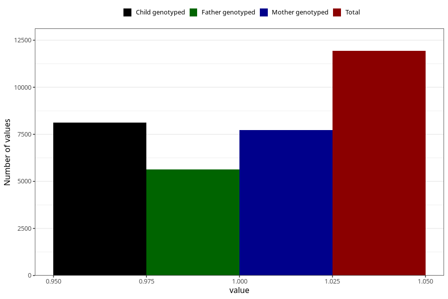

# abdominal_pain_5w_8w
Variable mapping to questionnaire: q1m, question AA187.
- Number of values:

| Value | Total | Child genotyped | Mother genotyped | Father genotyped |
| ----- | ----- | --------------- | ---------------- | ---------------- |
| Missing | 101694 | 67313 | 64051 | 44589 |
| Non-missing | 11929 | 8118 | 7718 | 5629 |
| 1 | 11929 | 8118 | 7718 | 5629 |

