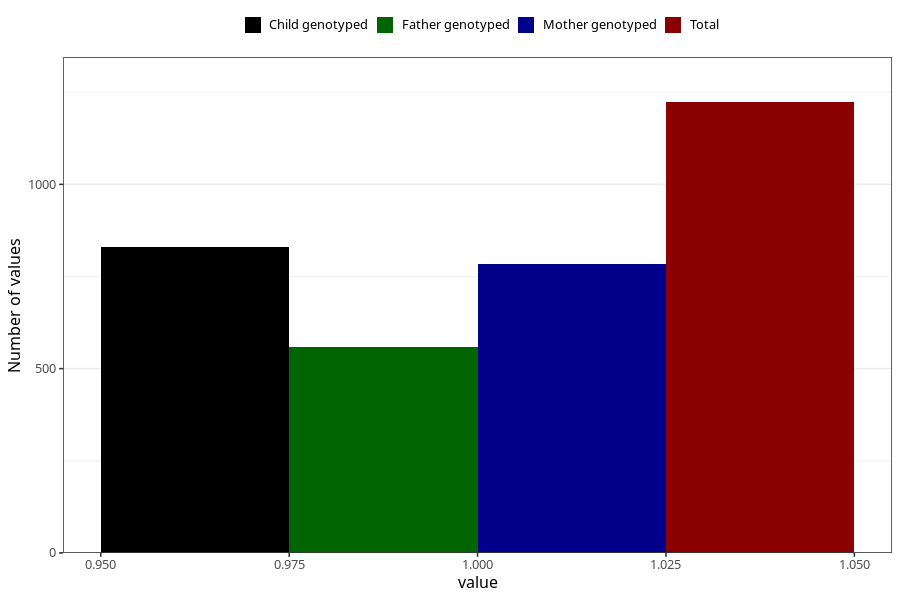

# fever_over385_5w_8w
Variable mapping to questionnaire: q1m, question AA337.
- Number of values:

| Value | Total | Child genotyped | Mother genotyped | Father genotyped |
| ----- | ----- | --------------- | ---------------- | ---------------- |
| Missing | 112400 | 74601 | 70986 | 49660 |
| Non-missing | 1223 | 830 | 783 | 558 |
| 1 | 1223 | 830 | 783 | 558 |

