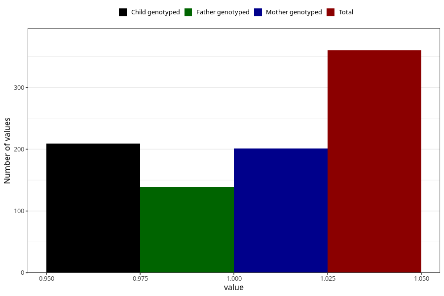

# hospitalized_threatening_preterm_labour_after_29w
Variable mapping to questionnaire: q3, question CC172.
- Number of values:

| Value | Total | Child genotyped | Mother genotyped | Father genotyped |
| ----- | ----- | --------------- | ---------------- | ---------------- |
| Missing | 113263 | 75222 | 71568 | 50079 |
| Non-missing | 360 | 209 | 201 | 139 |
| 1 | 360 | 209 | 201 | 139 |

