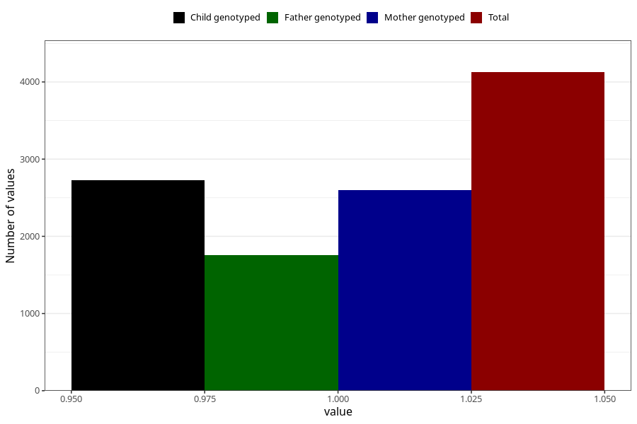

# oedema_13w_15w
Variable mapping to questionnaire: q1m, question AA319.
- Number of values:

| Value | Total | Child genotyped | Mother genotyped | Father genotyped |
| ----- | ----- | --------------- | ---------------- | ---------------- |
| Missing | 109497 | 72703 | 69168 | 48461 |
| Non-missing | 4126 | 2728 | 2601 | 1757 |
| 1 | 4126 | 2728 | 2601 | 1757 |

