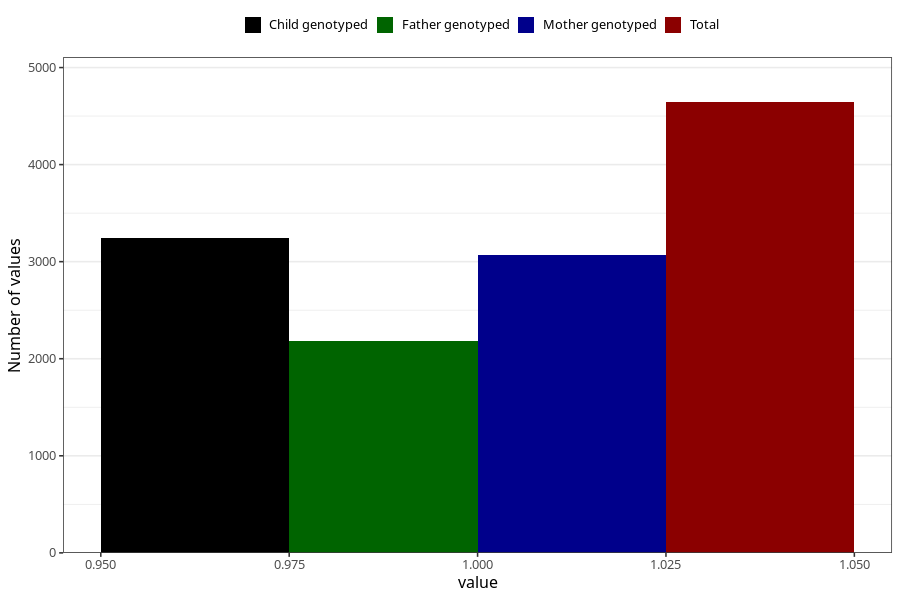

# other_muscle_joint_pain_17w_20w
Variable mapping to questionnaire: q3, question CC365.
- Number of values:

| Value | Total | Child genotyped | Mother genotyped | Father genotyped |
| ----- | ----- | --------------- | ---------------- | ---------------- |
| Missing | 108980 | 72186 | 68696 | 48032 |
| Non-missing | 4643 | 3245 | 3073 | 2186 |
| 1 | 4643 | 3245 | 3073 | 2186 |

