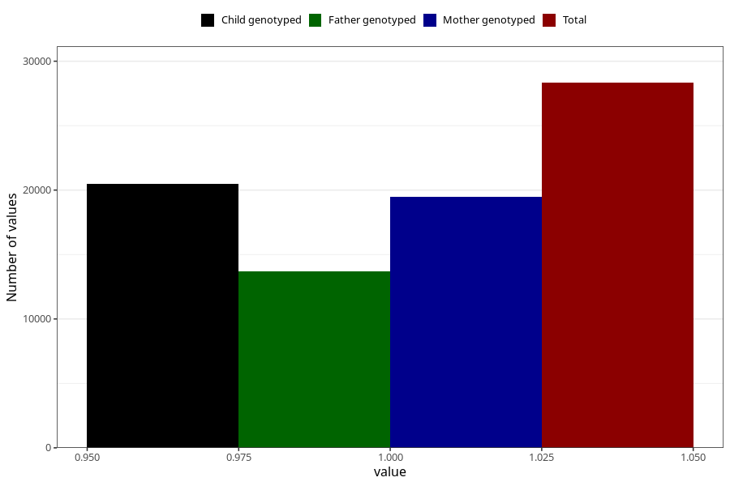

# pelvic_girdle_pain_25w_28w
Variable mapping to questionnaire: q3, question CC343.
- Number of values:

| Value | Total | Child genotyped | Mother genotyped | Father genotyped |
| ----- | ----- | --------------- | ---------------- | ---------------- |
| Missing | 85297 | 54934 | 52287 | 36528 |
| Non-missing | 28326 | 20497 | 19482 | 13690 |
| 1 | 28326 | 20497 | 19482 | 13690 |

