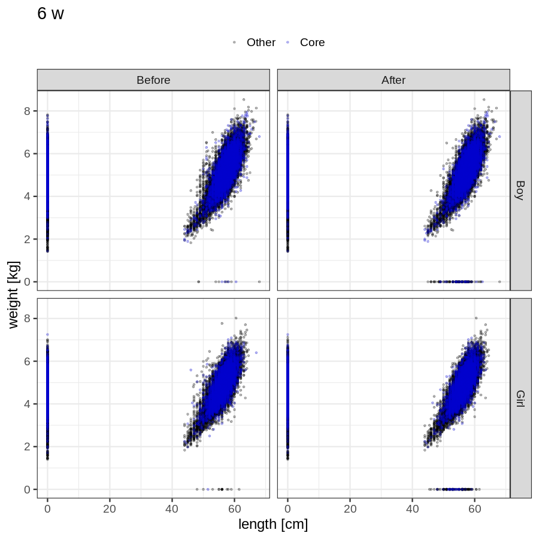
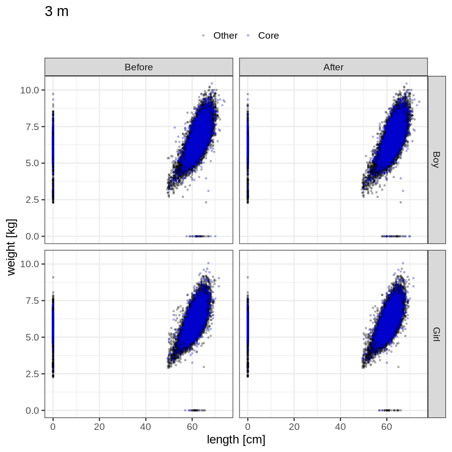
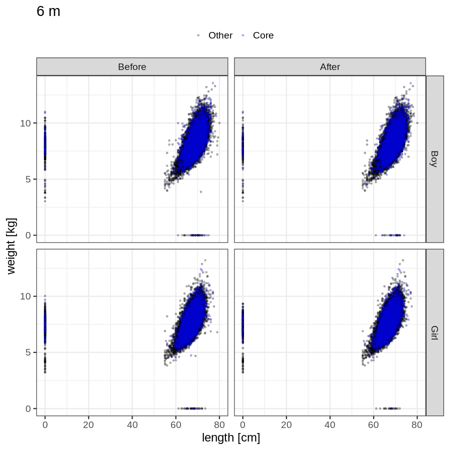
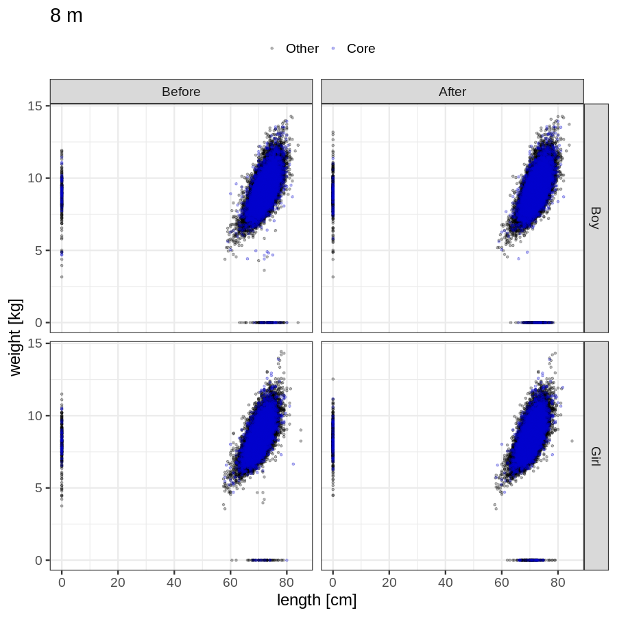
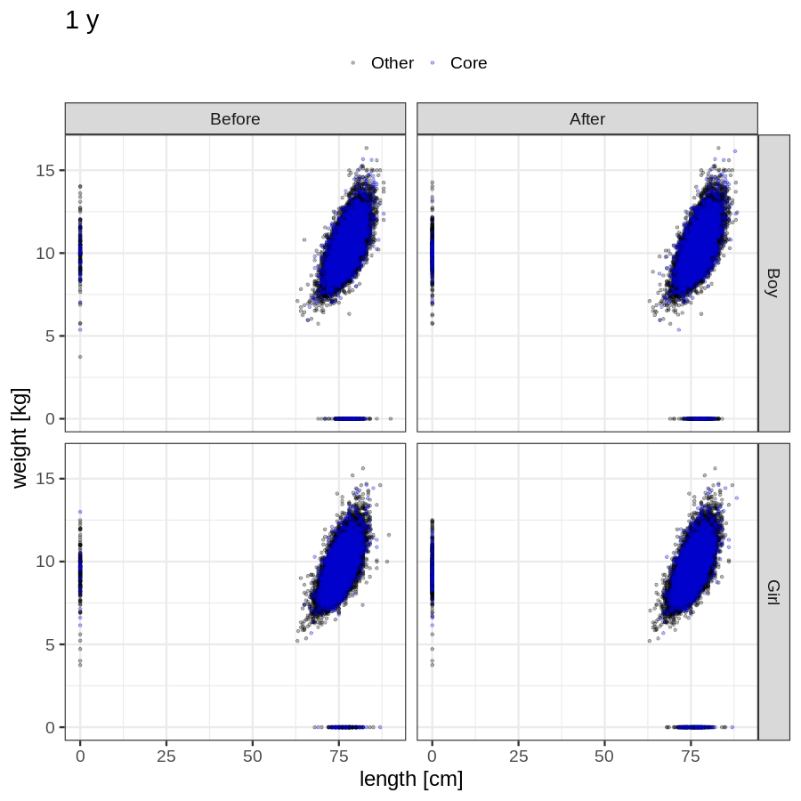
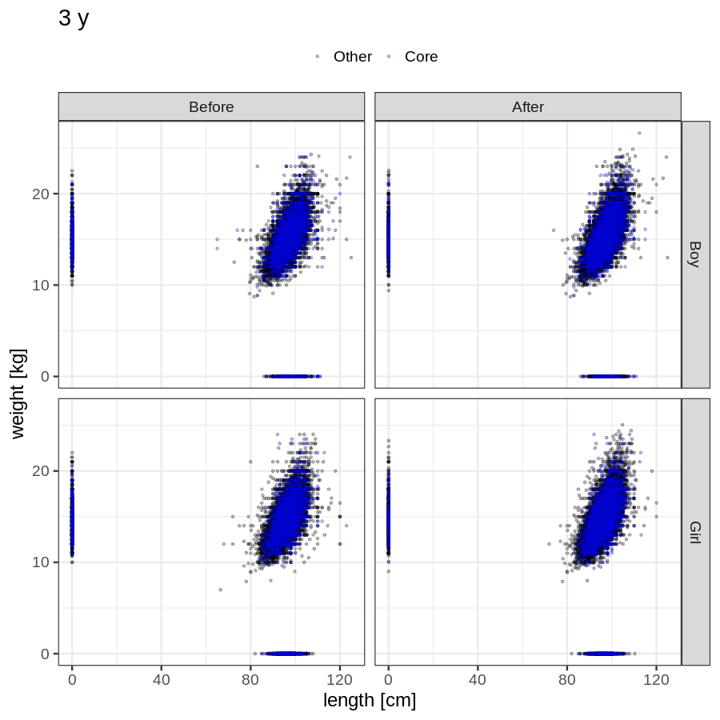

# Phenotypes
### Number of values

### Length vs weight

### Imputation
- Children with no data point altered: 68674
- Children with at least one data point altered: 44949
#### Random example: 39899
> imputed@length_16m imputed@length_2y imputed@weight_16m imputed@weight_2y

#### Random example: 23133
> imputed@length_16m imputed@length_2y imputed@weight_16m imputed@weight_2y

#### Random example: 39036
> imputed@length_16m imputed@length_2y imputed@weight_16m imputed@weight_2y

#### Random example: 6847
> imputed@length_16m imputed@length_2y imputed@weight_16m imputed@weight_2y

#### Random example: 11114
> imputed@length_16m imputed@length_2y imputed@weight_16m imputed@weight_2y

#### Random example: 110170
> imputed@length_16m imputed@length_2y imputed@weight_16m imputed@weight_2y

#### Random example: 52290
> imputed@length_16m imputed@length_2y imputed@weight_16m imputed@weight_2y

#### Random example: 15193
> imputed@length_16m imputed@length_2y imputed@weight_16m imputed@weight_2y

#### Random example: 66104
> imputed@length_16m imputed@length_2y imputed@weight_16m imputed@weight_2y

#### Random example: 14104
> imputed@length_16m imputed@length_2y imputed@weight_16m imputed@weight_2y

#### Random example: 72339
> imputed@length_16m imputed@length_2y imputed@weight_16m imputed@weight_2y

#### Random example: 68778
> imputed@length_16m imputed@length_2y imputed@weight_16m imputed@weight_2y

#### Random example: 35963
> imputed@length_16m imputed@length_2y imputed@weight_16m imputed@weight_2y

#### Random example: 63080
> imputed@length_16m imputed@length_2y imputed@weight_16m imputed@weight_2y

#### Random example: 1300
> imputed@length_16m imputed@length_2y imputed@weight_16m imputed@weight_2y

#### Random example: 112754
> imputed@length_16m imputed@length_2y imputed@weight_16m imputed@weight_2y

#### Random example: 47494
> imputed@length_16m imputed@length_2y imputed@weight_16m imputed@weight_2y

#### Random example: 53836
> imputed@length_16m imputed@length_2y imputed@weight_16m imputed@weight_2y

#### Random example: 81096
> imputed@length_16m imputed@length_2y imputed@weight_16m imputed@weight_2y

#### Random example: 6227
> imputed@length_16m imputed@length_2y imputed@weight_16m imputed@weight_2y

#### Most extreme example (1): 77772
> 

#### Most extreme example (2): 95613
> 

#### Most extreme example (3): 10916
> imputed@length_16m imputed@length_2y imputed@weight_16m imputed@weight_2y

#### Most extreme example (4): 110341
> imputed@length_16m imputed@length_2y imputed@weight_16m imputed@weight_2y

#### Most extreme example (5): 40082
> 

#### Most extreme example (6): 101619
> imputed@length_8m imputed@length_1y imputed@length_16m imputed@weight_8m imputed@weight_1y imputed@weight_16m

#### Most extreme example (7): 102757
> outlier@length_2y imputed@length_2y

#### Most extreme example (8): 111785
> 

#### Most extreme example (9): 59495
> 

#### Most extreme example (10): 104611
> imputed@length_5y imputed@weight_5y

#### Most extreme example (11): 90267
> 

#### Most extreme example (12): 61284
> imputed@weight_6m imputed@weight_8m imputed@weight_16m

#### Most extreme example (13): 100404
> imputed@length_16m imputed@length_2y imputed@weight_16m imputed@weight_2y

#### Most extreme example (14): 68476
> 

#### Most extreme example (15): 84307
> 

#### Most extreme example (16): 76171
> imputed@weight_2y outlier@weight_1y imputed@weight_1y

#### Most extreme example (17): 59541
> 

#### Most extreme example (18): 59610
> 

#### Most extreme example (19): 96239
> imputed@length_16m imputed@length_2y imputed@weight_16m imputed@weight_2y

#### Most extreme example (20): 22195
> 

