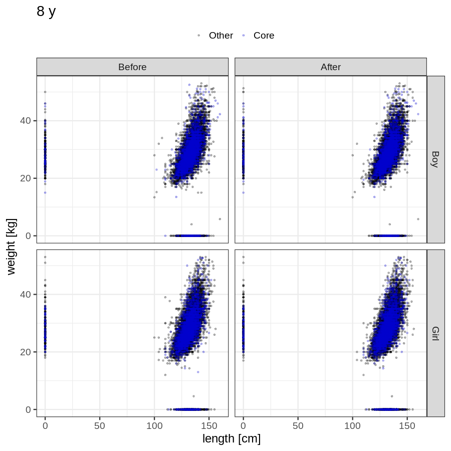
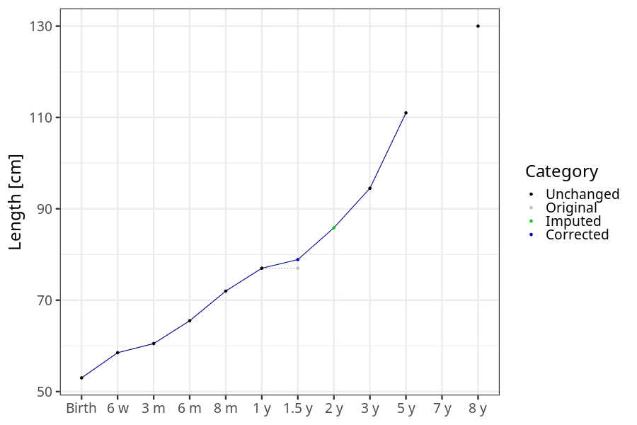
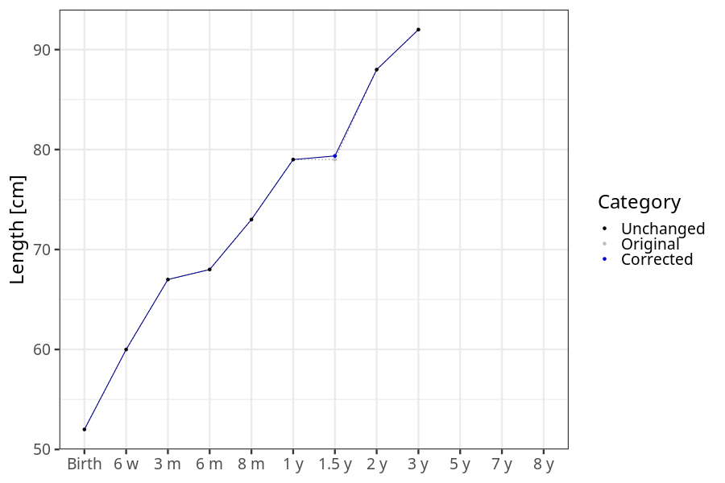

# Phenotypes
### Number of values

### Length vs weight

### Imputation
- Children with no data point altered: 68674
- Children with at least one data point altered: 44949
#### Random example: 12818
> imputed@length_16m imputed@length_2y imputed@weight_16m imputed@weight_2y

#### Random example: 97865
> imputed@length_16m imputed@length_2y imputed@weight_16m imputed@weight_2y

#### Random example: 60088
> imputed@length_16m imputed@length_2y imputed@weight_16m imputed@weight_2y

#### Random example: 80029
> imputed@length_16m imputed@length_2y imputed@weight_16m imputed@weight_2y

#### Random example: 60186
> imputed@length_16m imputed@length_2y imputed@weight_16m imputed@weight_2y

#### Random example: 66100
> imputed@length_16m imputed@length_2y imputed@weight_16m imputed@weight_2y

#### Random example: 57052
> imputed@length_16m imputed@length_2y imputed@weight_16m imputed@weight_2y

#### Random example: 62469
> imputed@length_16m imputed@length_2y imputed@weight_16m imputed@weight_2y

#### Random example: 106977
> imputed@length_16m imputed@length_2y imputed@weight_16m imputed@weight_2y

#### Random example: 3895
> imputed@length_16m imputed@length_2y imputed@weight_16m imputed@weight_2y

#### Random example: 65299
> imputed@length_16m imputed@length_2y imputed@weight_16m imputed@weight_2y

#### Random example: 87073
> imputed@length_16m imputed@length_2y imputed@weight_16m imputed@weight_2y

#### Random example: 38562
> imputed@length_16m imputed@length_2y imputed@weight_16m imputed@weight_2y

#### Random example: 42546
> imputed@length_16m imputed@length_2y imputed@weight_16m imputed@weight_2y

#### Random example: 27508
> imputed@length_16m imputed@length_2y imputed@weight_16m imputed@weight_2y

#### Random example: 77994
> imputed@length_16m imputed@length_2y imputed@weight_16m imputed@weight_2y

#### Random example: 36985
> imputed@length_16m imputed@length_2y imputed@weight_16m imputed@weight_2y

#### Random example: 109907
> imputed@length_16m imputed@length_2y imputed@weight_16m imputed@weight_2y

#### Random example: 32235
> imputed@length_16m imputed@length_2y imputed@weight_16m imputed@weight_2y

#### Random example: 56868
> imputed@length_16m imputed@length_2y imputed@weight_16m imputed@weight_2y

#### Most extreme example (1): 87409
> 

#### Most extreme example (2): 54700
> 

#### Most extreme example (3): 71948
> imputed@length_16m imputed@length_2y imputed@weight_16m imputed@weight_2y

#### Most extreme example (4): 74969
> imputed@length_16m imputed@length_2y imputed@weight_16m imputed@weight_2y

#### Most extreme example (5): 21093
> 

#### Most extreme example (6): 3698
> imputed@length_8m imputed@length_1y imputed@length_16m imputed@weight_8m imputed@weight_1y imputed@weight_16m

#### Most extreme example (7): 84273
> outlier@length_2y imputed@length_2y

#### Most extreme example (8): 49135
> 

#### Most extreme example (9): 64500
> 

#### Most extreme example (10): 67354
> imputed@length_5y imputed@weight_5y

#### Most extreme example (11): 64576
> 

#### Most extreme example (12): 57039
> imputed@weight_6m imputed@weight_8m imputed@weight_16m

#### Most extreme example (13): 79844
> imputed@length_16m imputed@length_2y imputed@weight_16m imputed@weight_2y

#### Most extreme example (14): 95608
> 

#### Most extreme example (15): 62218
> 

#### Most extreme example (16): 57107
> imputed@weight_2y outlier@weight_1y imputed@weight_1y

#### Most extreme example (17): 92890
> 

#### Most extreme example (18): 105219
> 

#### Most extreme example (19): 5434
> imputed@length_16m imputed@length_2y imputed@weight_16m imputed@weight_2y

#### Most extreme example (20): 22354
> 

