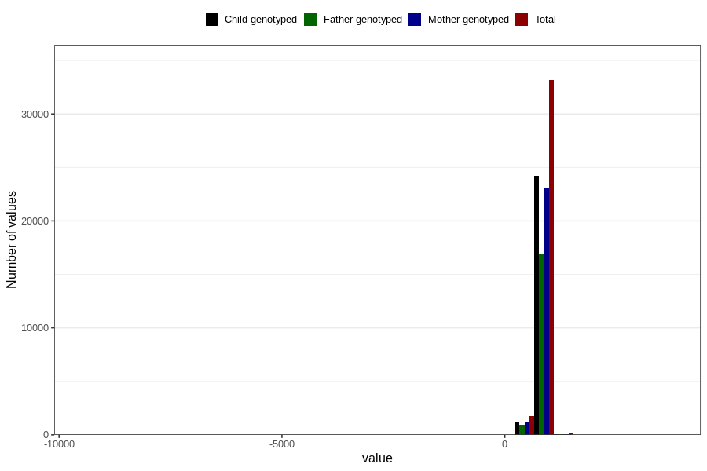

# age_2y
Variable mapping to questionnaire: q6, question Q6_AGE_2_Y.
- Number of values:

| Value | Total | Child genotyped | Mother genotyped | Father genotyped |
| ----- | ----- | --------------- | ---------------- | ---------------- |
| Missing | 78597 | 49864 | 47408 | 32392 |
| Non-missing | 35026 | 25567 | 24361 | 17826 |
| 25th percentile | 734 | 734 | 734 | 734 |
| 50th percentile | 759 | 759 | 759 | 761 |
| 75th percentile | 806 | 806 | 806 | 808 |

