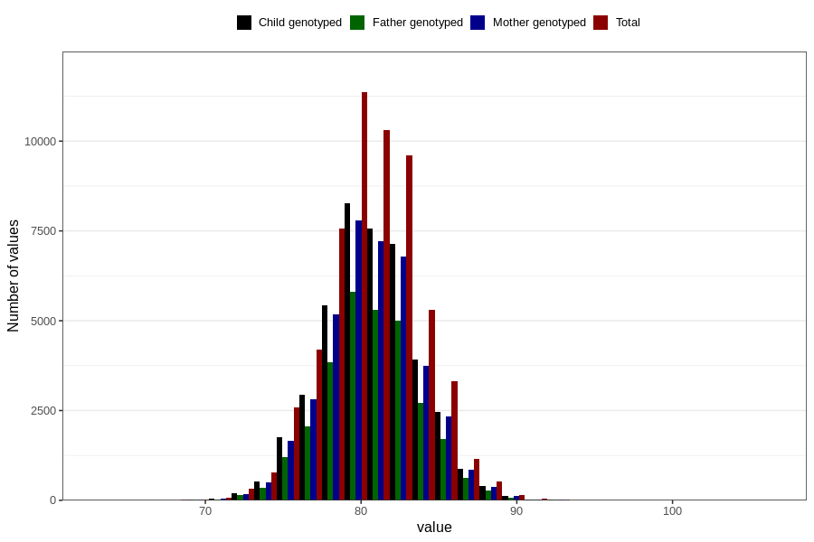

# length_16m
- Number of values:

| Value | Total | Child genotyped | Mother genotyped | Father genotyped |
| ----- | ----- | --------------- | ---------------- | ---------------- |
| Missing | 56241 | 33723 | 32133 | 21024 |
| Non-missing | 57382 | 41708 | 39636 | 29194 |
| 25th percentile | 78.5667147180463 | 78.722608534045 | 78.7087116935063 | 78.7204803431088 |
| 50th percentile | 80.5150074944125 | 80.6627292484677 | 80.6740180807166 | 80.6411233367755 |
| 75th percentile | 82.5535041722534 | 82.6579933490853 | 82.6598756451474 | 82.611052524897 |

