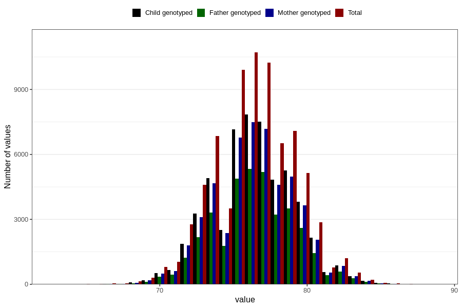

# length_1y
Variable mapping to questionnaire: q5, question EE393.
- Number of values:

| Value | Total | Child genotyped | Mother genotyped | Father genotyped |
| ----- | ----- | --------------- | ---------------- | ---------------- |
| Missing | 38120 | 20699 | 19658 | 13107 |
| Non-missing | 75503 | 54732 | 52111 | 37111 |
| 25th percentile | 74.5 | 74.5 | 74.5 | 74.5887005522911 |
| 50th percentile | 76.5 | 76.5 | 76.5 | 76.5 |
| 75th percentile | 78 | 78.1037529860797 | 78.1 | 78.0148992886687 |

