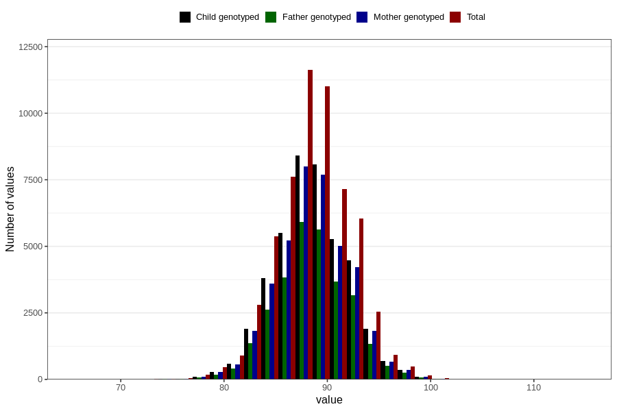

# length_2y
Variable mapping to questionnaire: q6, question GG20.
- Number of values:

| Value | Total | Child genotyped | Mother genotyped | Father genotyped |
| ----- | ----- | --------------- | ---------------- | ---------------- |
| Missing | 56253 | 33830 | 32238 | 21111 |
| Non-missing | 57370 | 41601 | 39531 | 29107 |
| 25th percentile | 86.0809647901484 | 86.2896348012889 | 86.2775769785555 | 86.3411969069871 |
| 50th percentile | 88.5 | 88.6091137109182 | 88.60294581663 | 88.6235276153693 |
| 75th percentile | 91 | 91 | 91 | 91 |

