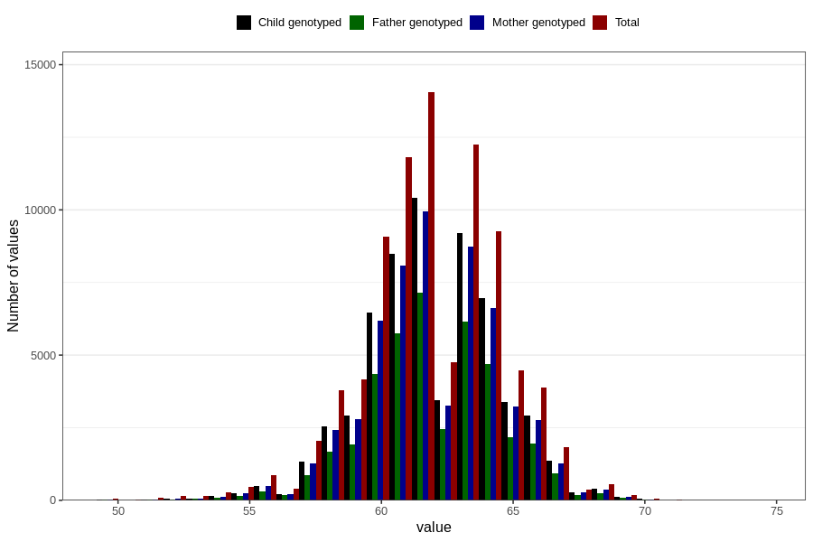

# length_3m
Variable mapping to questionnaire: q4, question DD219.
- Number of values:

| Value | Total | Child genotyped | Mother genotyped | Father genotyped |
| ----- | ----- | --------------- | ---------------- | ---------------- |
| Missing | 28574 | 13842 | 13113 | 8722 |
| Non-missing | 85049 | 61589 | 58656 | 41496 |
| 25th percentile | 60 | 60.5 | 60.5 | 60.5 |
| 50th percentile | 62 | 62 | 62 | 62 |
| 75th percentile | 63.5 | 64 | 64 | 63.5691774399491 |

