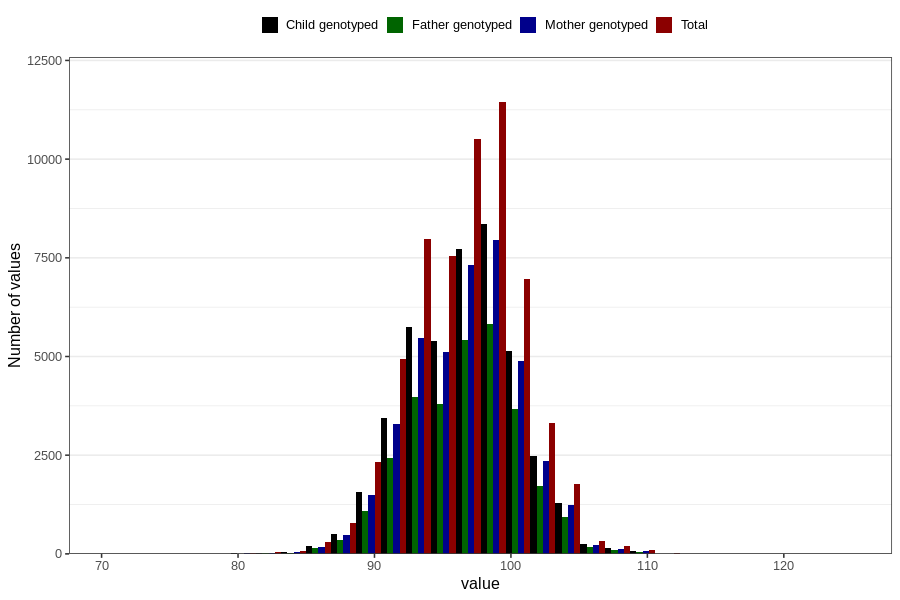

# length_3y
Variable mapping to questionnaire: q6, question GG25.
- Number of values:

| Value | Total | Child genotyped | Mother genotyped | Father genotyped |
| ----- | ----- | --------------- | ---------------- | ---------------- |
| Missing | 54927 | 33000 | 31479 | 20485 |
| Non-missing | 58696 | 42431 | 40290 | 29733 |
| 25th percentile | 94 | 94 | 94 | 94 |
| 50th percentile | 96.7673398118025 | 97 | 97 | 97 |
| 75th percentile | 99 | 99 | 99 | 99 |

