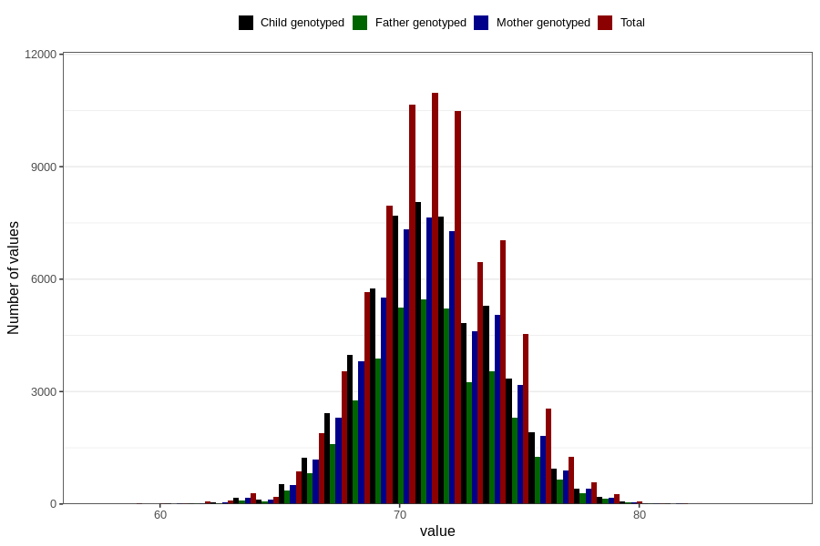

# length_8m
Variable mapping to questionnaire: q5, question EE387.
- Number of values:

| Value | Total | Child genotyped | Mother genotyped | Father genotyped |
| ----- | ----- | --------------- | ---------------- | ---------------- |
| Missing | 38069 | 20668 | 19630 | 13109 |
| Non-missing | 75554 | 54763 | 52139 | 37109 |
| 25th percentile | 69.5 | 69.5 | 69.5 | 69.5 |
| 50th percentile | 71 | 71.292118227284 | 71.2915638428564 | 71.3 |
| 75th percentile | 73 | 73 | 73 | 73 |

