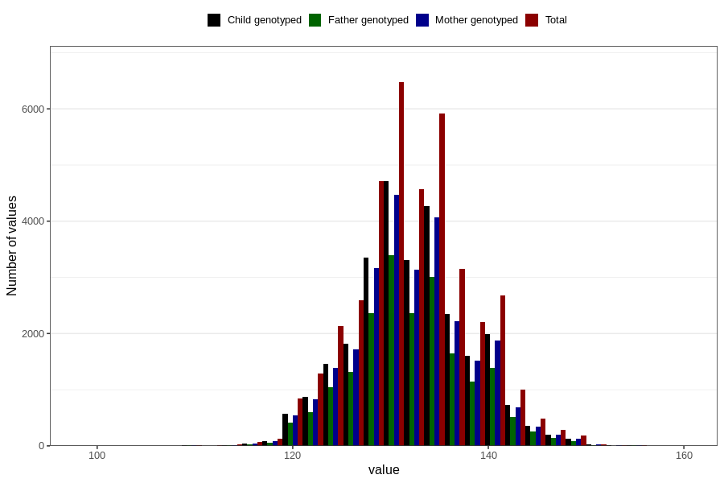

# length_8y
Variable mapping to questionnaire: q9, question NN24.
- Number of values:

| Value | Total | Child genotyped | Mother genotyped | Father genotyped |
| ----- | ----- | --------------- | ---------------- | ---------------- |
| Missing | 74834 | 47501 | 45297 | 30406 |
| Non-missing | 38789 | 27930 | 26472 | 19812 |
| 25th percentile | 128 | 129 | 129 | 129 |
| 50th percentile | 132 | 132 | 132 | 132 |
| 75th percentile | 136 | 136 | 136 | 136 |

