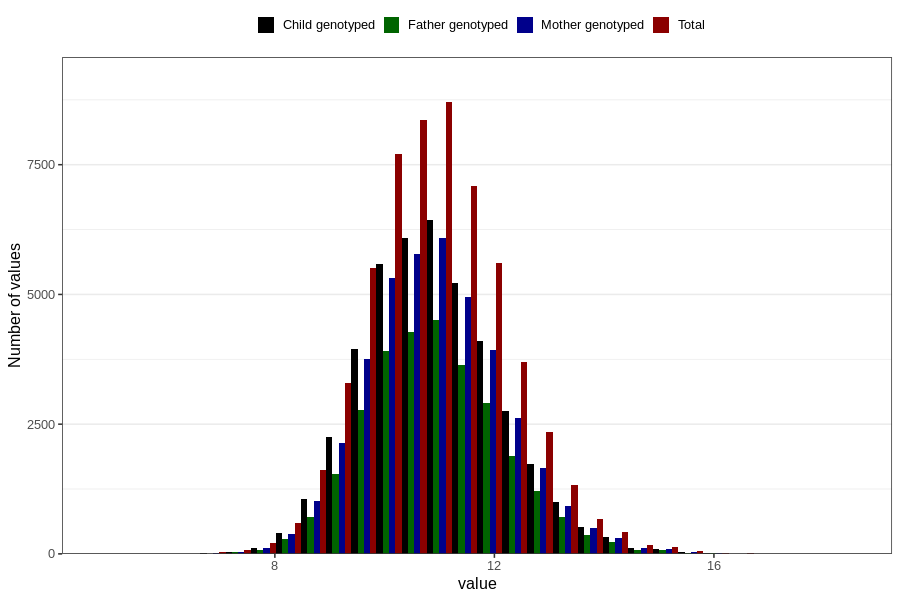

# weight_16m
- Number of values:

| Value | Total | Child genotyped | Mother genotyped | Father genotyped |
| ----- | ----- | --------------- | ---------------- | ---------------- |
| Missing | 55963 | 33582 | 32009 | 20950 |
| Non-missing | 57660 | 41849 | 39760 | 29268 |
| 25th percentile | 10.0361403202136 | 10.08 | 10.08 | 10.0840814666367 |
| 50th percentile | 10.8379788328937 | 10.87 | 10.87 | 10.8699477591684 |
| 75th percentile | 11.69 | 11.7 | 11.7 | 11.7 |

