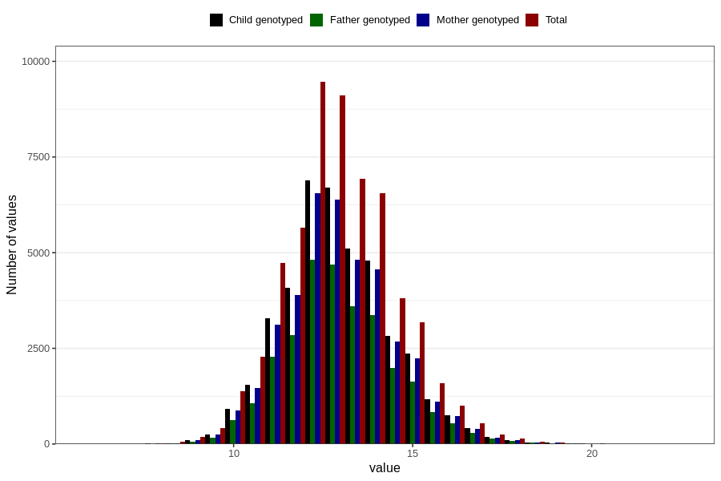

# weight_2y
Variable mapping to questionnaire: q6, question GG21.
- Number of values:

| Value | Total | Child genotyped | Mother genotyped | Father genotyped |
| ----- | ----- | --------------- | ---------------- | ---------------- |
| Missing | 56178 | 33792 | 32210 | 21101 |
| Non-missing | 57445 | 41639 | 39559 | 29117 |
| 25th percentile | 11.9419139578057 | 12 | 12 | 12 |
| 50th percentile | 12.9 | 12.94 | 12.9384206627124 | 12.9530211463621 |
| 75th percentile | 13.9604532758308 | 14 | 14 | 14 |

