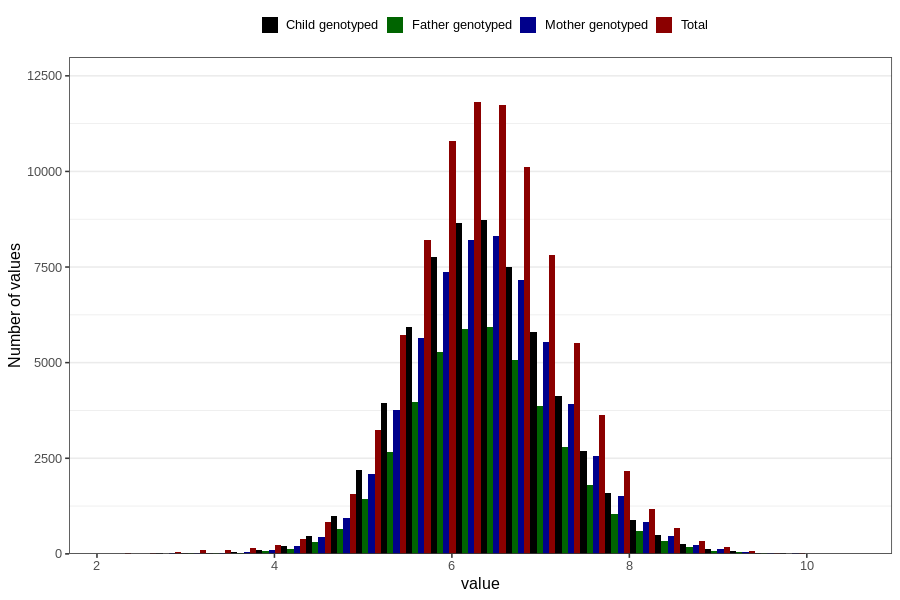

# weight_3m
Variable mapping to questionnaire: q4, question DD218.
- Number of values:

| Value | Total | Child genotyped | Mother genotyped | Father genotyped |
| ----- | ----- | --------------- | ---------------- | ---------------- |
| Missing | 26899 | 12780 | 12107 | 8004 |
| Non-missing | 86724 | 62651 | 59662 | 42214 |
| 25th percentile | 5.792 | 5.83 | 5.83 | 5.83 |
| 50th percentile | 6.33 | 6.35 | 6.35 | 6.35 |
| 75th percentile | 6.885 | 6.9 | 6.9 | 6.9 |

