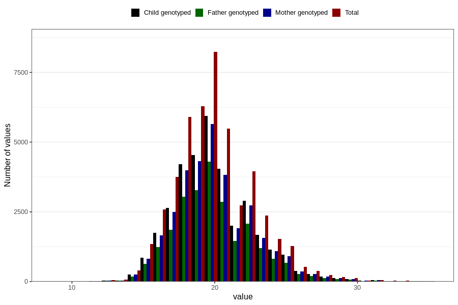

# weight_5y
Variable mapping to questionnaire: q7, question LL13.
- Number of values:

| Value | Total | Child genotyped | Mother genotyped | Father genotyped |
| ----- | ----- | --------------- | ---------------- | ---------------- |
| Missing | 65996 | 41204 | 39320 | 25727 |
| Non-missing | 47627 | 34227 | 32449 | 24491 |
| 25th percentile | 18 | 18 | 18 | 18 |
| 50th percentile | 19.9 | 20 | 20 | 20 |
| 75th percentile | 21.5 | 21.5197874702617 | 21.5 | 21.5 |

