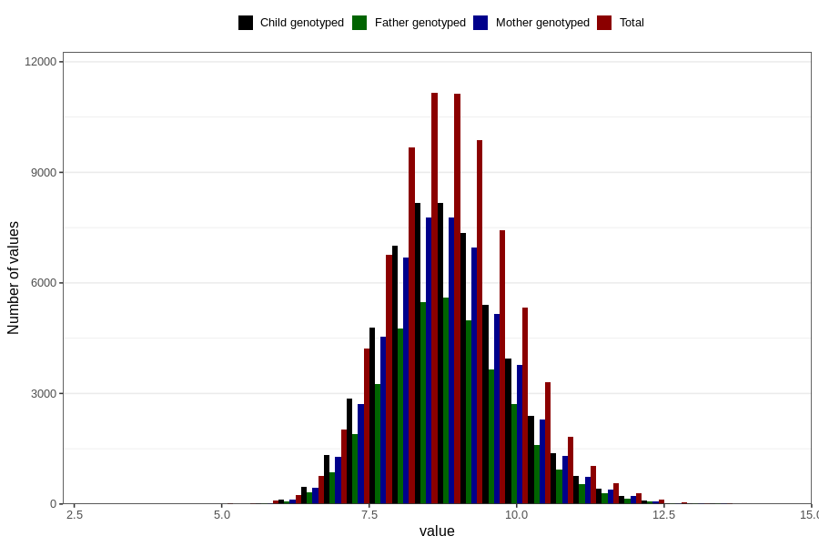

# weight_8m
Variable mapping to questionnaire: q5, question EE386.
- Number of values:

| Value | Total | Child genotyped | Mother genotyped | Father genotyped |
| ----- | ----- | --------------- | ---------------- | ---------------- |
| Missing | 37639 | 20422 | 19390 | 12952 |
| Non-missing | 75984 | 55009 | 52379 | 37266 |
| 25th percentile | 8.09 | 8.12 | 8.12 | 8.13 |
| 50th percentile | 8.75854038501588 | 8.78 | 8.78 | 8.78 |
| 75th percentile | 9.47 | 9.485 | 9.49 | 9.485 |

