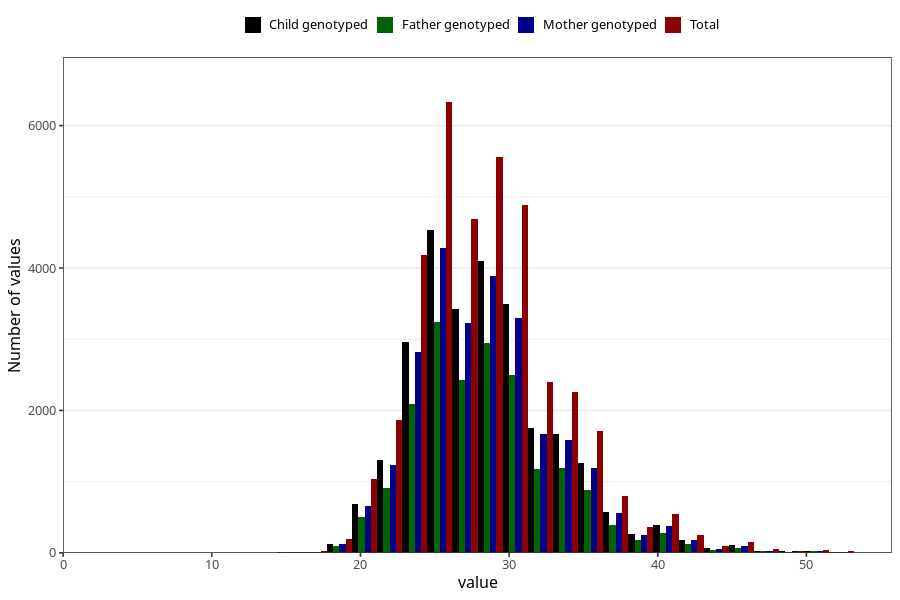

# weight_8y
Variable mapping to questionnaire: q9, question NN25.
- Number of values:

| Value | Total | Child genotyped | Mother genotyped | Father genotyped |
| ----- | ----- | --------------- | ---------------- | ---------------- |
| Missing | 76113 | 48409 | 46175 | 31073 |
| Non-missing | 37510 | 27022 | 25594 | 19145 |
| 25th percentile | 25 | 25 | 25 | 25 |
| 50th percentile | 28 | 28 | 28 | 28 |
| 75th percentile | 31 | 31 | 31 | 31 |

