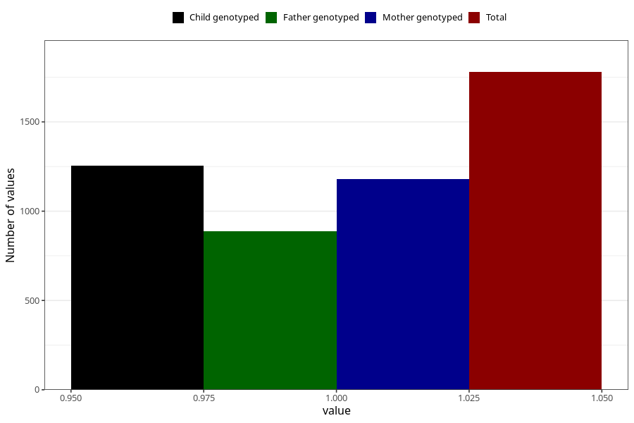

# asthma_previous_3y
Variable mapping to questionnaire: q6, question GG71.
- Number of values:

| Value | Total | Child genotyped | Mother genotyped | Father genotyped |
| ----- | ----- | --------------- | ---------------- | ---------------- |
| Missing | 111844 | 74178 | 70588 | 49331 |
| Non-missing | 1779 | 1253 | 1181 | 887 |
| 1 | 1779 | 1253 | 1181 | 887 |

